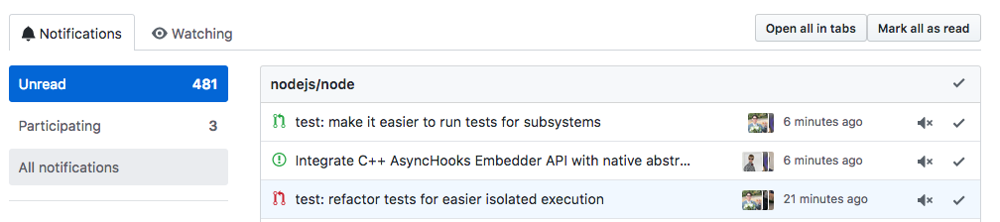

# Github Notifications in Tabs

If you're like me you frequently end up with way too many Github Notifications.

This extension adds an extra button to the <a
href="https://github.com/notifications">GitHub notifications page</a> that opens
the current page of unread notifications in tabs.

This also doubles as a good test of your browser's ability to handle ~30 new
tabs at once. Both Firefox (post-e10s) and Chrome handle this pretty well.

For more information see https://github.com/gibfahn/gnt



### Installing

Addons are published here (note that they're not 100% working yet)

- [Firefox Add-on page][]
- [Chrome Add-on page][]

### About WebExtensions

This extension uses the cool new [webextensions api][] (official website
[here][browser extensions]), which means that it works with the newest Firefox,
and will soon work with Chrome. For now though we need to polyfill chrome
support.

### Running locally

To set up this repo:

```bash
git clone --recursive https://github.com/gibfahn/gnt && cd gnt
```

You can load the extension directly from `about:debugging` (Firefox) and
`chrome://extensions` (Chrome). Load the `github-notifications-in-tabs`
subdirectory.

### Developing

To run various useful commands use `./do` (see src for info):

```bash
./do     # Prints available commands.
./do run # Runs web-ext.
```

### Uploading a new version

- Make changes.
- Test changes.
- Update deps: `./do update; ./do icon`
- Bump version in `github-notifications-in-tabs/manifest.json`.
- Commit changes.
- Build zip: `./do build`
- Upload to [Firefox Dashboard][] and [Chrome Dashboard][]
- Tag release.

[Firefox Add-on page]: https://addons.mozilla.org/en-GB/firefox/addon/github-notifications-in-tabs/
[Chrome Add-on page]: https://chrome.google.com/webstore/detail/github-notifications-in-t/mcccfglfeaibmhkbnkgdkkhoakjdafdf
[webextensions api]: https://developer.mozilla.org/en-US/Add-ons/WebExtensions
[browser extensions]: https://browserext.github.io/browserext/
[Firefox Dashboard]: https://addons.mozilla.org/en-GB/developers/addon/github-notifications-in-tabs/
[Chrome Dashboard]: https://chrome.google.com/webstore/developer/dashboard
